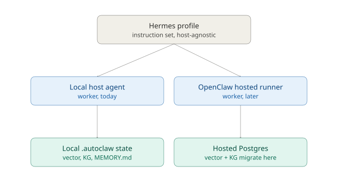

# agent-synthetix — Phase 1–7 Architecture Plan

**Scope:** Turns the 8 open-question blocks in `BRAINSTORM.md` into a buildable sequence, following the stated priority order:
ResearchHermes → Approval gate + Pages → BlogHermes → `/learn` → Issue sync → Thread/Report Hermes → OpenClaw.

**Format:** Each phase = Context → Recommended Decision → Trade-offs → Consequences → Action Items, consistent with the ADR discipline already used across AgentLens/kinegraph-v/Polaris. Recommendations are defaults to accept, revise, or override — not final answers. Items still needing your call are flagged **[DECISION NEEDED]** and carried into the questions at the end.

---

## Phase 0 — Cross-Cutting: Hermes Profile Format (BRAINSTORM §1)

### Context
Every downstream phase (ResearchHermes, BlogHermes, ThreadHermes, ReportHermes) instantiates a "Hermes profile." Getting the format right once avoids a rewrite at phase 3.

### Recommended Decision
**Directory-per-profile**, not single-file:

```
.agent/rules/hermes/
  research/
    profile.md          ← persona, tone, scope (loaded as the rule)
    prompt.md            ← templated prompt with {{variables}}
    tone.yaml             ← tone knobs (formality, verbosity, voice)
    examples/             ← 2-3 few-shot output samples
  blog/
    profile.md
    prompt.md
    tone.yaml
    examples/
  thread/
    profile.md
    prompt.md
    tone.yaml
    platforms.yaml        ← per-platform limits (see below)
    examples/
```

`profile.md` stays the single file the agent's rule-loader reads (keeps `.agent/rules/*.md` host-agnostic contract intact); it references the sibling files by relative path. This is additive — doesn't break the "one file per rule" convention other subsystems (Orchestrate, KDream) already use, it just lets Hermes profiles opt into richer structure.

### Tone Configuration
`tone.yaml` schema:
```yaml
formality: technical | casual | executive
voice: first_person | third_person
verbosity: terse | standard | expansive
audience: internal_team | public | client
```
Read by the profile at prompt-assembly time and interpolated into `prompt.md`. This gives BlogHermes = technical/first_person/standard/public and ReportHermes = executive/third_person/terse/internal_team as concrete, diffable config rather than prose instructions buried in the profile — easier to version and A/B.

### ThreadHermes Platform Awareness
**Yes**, ThreadHermes should know the target platform — length limits and thread-splitting logic differ materially (X: 280 chars/post with thread continuation; LinkedIn: ~3000 chars single post, no native threading; Bluesky: 300 chars). Recommend a `platforms.yaml` under the thread profile:
```yaml
platforms:
  x:
    max_chars: 280
    thread_style: numbered
  linkedin:
    max_chars: 3000
    thread_style: single_post
  bluesky:
    max_chars: 300
    thread_style: numbered
```
ThreadHermes takes `--platform` as an invocation arg (defaults to a configured primary platform) and formats/splits accordingly.

### Trade-offs
- Directory-per-profile is more files to scaffold than single-file, but the alternative (one giant `.md` with embedded YAML frontmatter for tone) gets unwieldy once you have 4 profiles × few-shot examples.
- `platforms.yaml` duplicates knowledge that could live in a shared `.autoclaw/hermes/platforms.yaml` if you ever want cross-profile platform awareness (e.g., ReportHermes also posting summaries to Slack). Start profile-local; promote to shared only if a second profile needs it.

### Action Items
- [x] Scaffold `.agent/rules/hermes/<profile>/` directories for research, blog, thread, report
- [x] Define `tone.yaml` schema in `docs/architecture-principles.md` §Hermes
- [x] Write ThreadHermes `platforms.yaml` with X/LinkedIn/Bluesky as first three

---

## Phase 1 — ResearchHermes + Diff Engine (BRAINSTORM §2)

### Context
Core value prop, per your priority order. ResearchHermes runs on a cadence (likely via AutoBuild cron or KDream tick), produces a memo, and needs to diff against yesterday's memo to surface `[NEW]`/`[CHANGED]`/`[REMOVED]`.

### Recommended Decision

**Topic matching:** Slug match first, semantic fallback. Each research memo entry gets a deterministic slug (`slugify(topic_title)`) at generation time, stored in memo frontmatter. Diff engine matches by slug; only when a *new* memo has no slug match against yesterday's set does it run a semantic-similarity pass (embedding cosine sim, threshold ~0.85) against unmatched entries — that catches topic drift (title reworded) without treating every diff as a fuzzy-match problem. This mirrors the vector-store-for-fuzzy / KG-for-structured split already established in `.autoclaw/`.

**Diff computation:** Semantic similarity between bullet points, not line-level git diff. Line diff is brittle against paraphrasing (the same fact restated slightly differently reads as `[CHANGED]` when nothing changed). Recommend: embed each bullet, compare against prior day's bullets for the same topic-slug; below similarity threshold → `[CHANGED]`; no match → `[NEW]`; prior bullet with no match today → `[REMOVED]`. This reuses `.autoclaw/vector/db.sqlite` rather than introducing a second diff mechanism.

**No-yesterday-memo case:** Confirmed — run full research, no diff, and tag the memo `baseline: true` in frontmatter so the next day's run knows there's a valid comparison point (avoids silently diffing against nothing 2 days running if a run gets skipped).

**Source URL tracking:** `.autoclaw/hermes/research/sources.json` (or a `sources` table in the vector store's SQLite) keyed by normalized URL (strip tracking params, trailing slash), storing `first_seen_date`, `topic_slugs[]`, `last_cited_date`. This is what lets the diff engine say "same source, new framing" vs "genuinely new source" — a distinction line-diff alone can't make.

### Trade-offs
- Semantic diff costs an embedding call per bullet per run vs. free line-diff — acceptable given ResearchHermes is a cadence job, not interactive.
- Slug-first matching means a badly-chosen slug (too generic) could wrongly merge two distinct topics. Mitigate with slug = `date-independent-hash-of(topic_title + top_source_domain)` rather than title alone.

### Consequences
- Establishes the semantic-diff pattern that BlogHermes/ReportHermes can later reuse for "what's changed since last report."
- Creates a dependency on the vector store being populated (`/index-code` doesn't cover this — you'd want a `/hermes index-research` or equivalent to embed bullets as they're generated).

### Action Items
- [x] Add `sources.json` (or SQLite table) schema — [schemas/hermes-research.md](../schemas/hermes-research.md)
- [x] Implement slug generation + semantic fallback matcher — ResearchHermes `profile.md`
- [x] Implement bullet-level embedding diff, threshold tunable via config — `similarity_threshold` / `bullet_similarity_threshold` in hermes config
- [x] Add `baseline: true` frontmatter handling for first-run case

**Phase 1 ship note (2026-08-08):** Spec + agent-executable rules landed. Runtime memos appear under gitignored `.autoclaw/hermes/` when you run `/hermes init` then `/hermes research <topic>`. Blog/Thread/Report remain scaffolds until later phases.

---

## Phase 2 — Approval Gate UX + GitHub Pages Publish (BRAINSTORM §3, §5)

### Context
Orchestrate's soft-gate approval is already decided (frontmatter `approved: true` or `/orchestrate approve`). Hermes/content publishing needs its own — separate — approval flow before anything reaches Pages.

### Recommended Decision — Approval Signal
**Support two, not three:** frontmatter edit *and* `/hermes approve <id>`, both writing to the same underlying state so either path is equivalent (same pattern as Orchestrate's soft gate). **Skip GitHub PR review as the primary path** — it adds a git-round-trip (branch, PR, merge) for what's fundamentally a local file-approval workflow, and duplicates the frontmatter mechanism. Reserve PR-based review for content that's *already* been approved locally and is being proposed as a Pages deploy — i.e., PR review gates the *publish*, not the *content approval*. That gives you two checkpoints without three redundant approval mechanisms:
1. `.autoclaw/hermes/pending/<id>.md` frontmatter `approved: true` (or `/hermes approve <id>`) → content approved, moves to `.autoclaw/hermes/approved/`
2. AutoBuild picks up approved content → opens a PR to `gh-pages` (or a `content` branch) → PR merge = publish gate

**Preview command:** Yes — `/hermes preview <id>` renders the Markdown (with frontmatter stripped) to a local temp HTML file and opens it, or streams it back as a rendered artifact in-chat if invoked from agent chat. Cheap to build (reuse whatever Markdown renderer the Pages SSG uses, see below) and meaningfully reduces "approved then regretted" cases.

### Recommended Decision — Pages Publishing
**SSG: Jekyll — confirmed.** Raw Markdown → Pages via Jekyll (GitHub Pages' native support, zero build-config). `_posts/` convention gives dated-folder organization for free. No Astro/11ty build step to maintain.

**Deploy path:** GitHub Actions workflow (`.github/workflows/pages.yml`) triggered on push to the content branch, not an AutoBuild cron step — deploy-on-merge is more correct than deploy-on-schedule for content that just went through PR review above. AutoBuild still owns the *cadence* of generating content; GitHub Actions owns the *deploy*.

**Content organization:** Dated folders (`_posts/YYYY-MM-DD-slug.md` — Jekyll's own convention), not one flat file per post. Matches ResearchHermes's daily cadence and makes the diff engine's "yesterday vs today" lookup a filesystem glob instead of a metadata query.

**Index page:** Yes, generated by Doc Writer — Jekyll's default `index.html` can auto-list `_posts/`, but have Doc Writer generate a curated index (grouped by Hermes profile: Research / Blog / Thread archive) since a flat reverse-chron list undersells a multi-profile site.

### Trade-offs
- Jekyll ties you to Ruby-based build tooling GitHub Pages hosts natively; Astro/11ty would need to build artifacts and push them, which is more moving parts for marginal early gain.
- Two-checkpoint approval (local + PR) is more friction than a single approve step, but matches the "human approval gates" non-functional principle already in the README and gives you a real diff-reviewable artifact (the PR) before anything goes public.

### Action Items
- [ ] Implement `/hermes approve <id>` + frontmatter equivalence check
- [ ] Implement `/hermes preview <id>`
- [ ] Scaffold Jekyll `_posts/` structure + `_config.yml`
- [ ] `.github/workflows/pages.yml` deploy-on-merge
- [ ] Doc Writer: generate curated index page per Hermes profile

---

## Phase 3 — BlogHermes Output Format (BRAINSTORM §1, applied)

### Context
First profile to actually exercise the Phase 0 directory format and Phase 2 publish pipeline end-to-end.

### Recommended Decision
BlogHermes consumes ResearchHermes's diffed memo as input (not raw research) — this is what makes the pipeline compound rather than three independent generators. Output target: Jekyll frontmatter-compliant Markdown written directly to `.autoclaw/hermes/pending/`, so it enters the Phase 2 approval flow unmodified. Tone default: `technical / first_person / standard / public` (Phase 0 schema) — matches your existing writing voice from the ADR practice.

### Action Items
- [ ] BlogHermes profile consumes ResearchHermes memo diff as primary input
- [ ] Output conforms to Jekyll frontmatter schema (title, date, tags, slug)
- [ ] End-to-end smoke: ResearchHermes → BlogHermes draft → approve → PR → Pages live

---

## Phase 4 — `/learn` Multi-Tool Ingestion (BRAINSTORM §7)

### Context
Lower priority per your ordering, but unblocks better BlogHermes/ResearchHermes quality sooner if pulled forward — flagging that as an option, not changing the sequence unless you want to.

### Recommended Decision
**[DECISION NEEDED]** — actual macOS session-storage paths for Kiro and Gemini aren't things I can verify without you pointing me at them (they're not publicly documented the way Claude Code's `~/.claude/` or Cursor's SQLite session store are). Recommend: spend a short spike confirming paths for all 5 tools before writing the ingester, rather than guessing — a wrong path silently ingests nothing rather than erroring loudly, which is worse than a stub.

**Kept-vs-discarded signal, tool-by-tool:**
- Claude Code: git diff (already decided) — commits after a session = kept, uncommitted/reverted = discarded.
- Cursor: same git-diff heuristic works (it operates on the same repo).
- Claude Desktop: no repo context by default — signal has to come from the conversation itself (did the user say "use this" / copy code out) or from an explicit `/learn --source desktop --mark-kept` manual flag. Lower-confidence source; tag learnings from it with a `confidence: manual` provenance stamp (matches the `verified_by` provenance pattern KDream already uses).
- Kiro / Gemini: unknown until the path/format spike above completes — plan for git-diff if they're repo-scoped, manual-flag if not.

### Action Items
- [ ] Spike: confirm session file paths for Kiro, Gemini, Cursor, Claude Desktop on macOS
- [ ] Extend `/learn` kept-signal logic per-tool (git-diff vs manual-flag vs provenance-stamped)
- [ ] Document findings in `docs/architecture-principles.md` §Intelligence

---

## Phase 5 — Linear / GitHub Issues Sync (BRAINSTORM §4)

### Recommended Decision
**Primary source: GitHub Issues — confirmed as sole source.** No `TaskSource` abstraction needed; build directly against the GitHub Issues API rather than an interface layer for a hypothetical second backend.

**Sync direction:** Bidirectional, but asymmetric — pull is authoritative for task *creation* (issue → manifest task), push is limited to *status* (manifest task state change → issue comment + label, not issue body rewrite). Full bidirectional field sync invites conflict resolution complexity you don't need yet.

**Cadence:** On every `/orchestrate plan`, not continuous via KDream tick — sync is a planning-time concern, and continuous sync risks a race with someone hand-editing the manifest mid-sprint (see Phase 8 below, same class of problem).

**Write-back:** Yes, sprint assignments as issue comments (not label changes to the issue itself) — comments are append-only and auditable, matches the "transparent... inspectable export" non-functional principle.

### Action Items
- [ ] `/orchestrate plan` pulls open GitHub Issues into manifest YAML (create-only)
- [ ] Sprint assignment → issue comment write-back
- [ ] Status changes (task done) → issue comment + close, not silent

---

## Phase 6 — ThreadHermes + ReportHermes

### Context
Mechanically reuses Phase 0's directory format and `platforms.yaml`; ReportHermes reuses Phase 1's semantic-diff pattern for "what changed since last report" instead of research memos.

### Action Items
- [ ] ThreadHermes: implement `--platform` arg against `platforms.yaml`
- [ ] ReportHermes: reuse bullet-level semantic diff against last report, executive/terse tone default

---

## Phase 7 — OpenClaw / Hosted Scale-Out (BRAINSTORM §6)

### Context
Lowest priority, correctly — this is infrastructure to defer until local usage patterns actually justify it.

### Recommended Decision
**OpenClaw = a hosted runner; state migrates — confirmed.** This is architecturally heavier than a relay/bridge: execution itself moves off-machine, so the local↔hosted boundary is a genuine data-migration problem, not just a proxy layer in front of `.autoclaw/`.

**Trigger heuristic:** cost and concurrent-agent count remain the right triggers for a file-native local-first system — latency degrades gracefully (agents queue on leases), cost and concurrency don't. Instrument `/orchestrate status` to track peak concurrent-agent count now, ahead of the migration threshold decision, so you have real usage data when this phase comes up.

**Local vs must-move, revised for "state migrates":**
- Vector store → Postgres+pgvector: straightforward, well-trodden path.
- Knowledge graph (`.autoclaw/kg/kg.db`) → **must migrate**, not stay local. Once execution runs on the hosted runner, coordination facts (leases, consensus, review findings) need to be visible where the agents actually run — a local-only KG would strand the hosted runner without scope-conflict data.
- `MEMORY.md` → recommend keeping this **local and append-only even post-migration**, as a deliberate exception rather than a default. The hosted runner reads it via export/sync but doesn't own it — keeps KDream's memory authoritative on the machine actually watching git status, rather than splitting write-ownership.
- **Migration mode: one-time cutover, not ongoing dual-write.** Running `.autoclaw/` as source of truth against both local SQLite and hosted Postgres simultaneously is exactly the split-brain state the lease/scope-conflict guards exist to prevent elsewhere in the system. Cut over KG + vector store together, in one migration event, not incrementally.

### Action Items
- [ ] Instrument concurrent-agent-count + cost tracking now, ahead of the migration trigger decision
- [ ] Design one-time KG + vector-store cutover procedure (not dual-write)
- [ ] Design `MEMORY.md` export/sync path for hosted runner to read without taking write-ownership

---

## Decision Log — Hermes / OpenClaw Relationship



**Context:** Once OpenClaw was confirmed as a hosted runner (state migrates, not a thin relay — see D3 above), it became worth pinning down explicitly how Hermes profiles and OpenClaw relate architecturally, since they're easy to mistake as peers when they're actually different layers of the same stack.

**Decision:** Hermes and OpenClaw are not coupled. Hermes profiles sit entirely in the **instruction set** layer (`.agent/rules/hermes/*`) and are host-agnostic by design. OpenClaw is a second implementation of the **Workers** layer — an alternate place the same Hermes rule can execute, alongside the local host agent (Claude Code, Cursor, Antigravity) that runs it today. A Hermes profile never needs rewriting when OpenClaw arrives; only which state store answers its reads/writes changes underneath it (local `.autoclaw/` vs hosted Postgres, per Phase 7's migration decision).

**What OpenClaw actually scales:** concurrency, not capability. It doesn't produce smarter or different Hermes output — it lets more Hermes-driven work (ResearchHermes, BlogHermes, ThreadHermes all firing on cadence) run in parallel across a fleet instead of queuing on one local machine's KDream ticks.

**Consequence for Phase 2 (approval gate):** the approval-state schema (`.autoclaw/hermes/pending/<id>.md`, frontmatter `approved: true`) should be designed now assuming a non-local worker may eventually need to read/write it — even though OpenClaw isn't being built yet. Retrofitting this later is more expensive than keeping it in mind while Phase 2 is still in design.

**New open item surfaced by this analysis — [DECISION NEEDED]:** Because Phase 7 now migrates the knowledge graph (not just the vector store), the Cross-Agent Protocol's lease/consensus mechanism (`.autoclaw/orchestrator/comms/`) — currently local-SQLite-only — becomes a genuinely distributed problem the moment OpenClaw workers join local ones: leases and 2/3-majority consensus need to stay globally consistent across local *and* hosted workers simultaneously, not just have their backing store copied over. This is a harder problem than the state migration alone and isn't yet scoped anywhere above. Options to consider when this comes up:
- Fold it into Phase 7 as an explicit sub-task rather than assuming migration = solved
- Treat it as its own phase, gated on Phase 7's cutover actually happening
- Decide it out of scope until OpenClaw has a concrete design (per D3, hosted-runner details are still TBD)

No decision made yet — flagging so it isn't silently assumed away when Phase 7 is eventually scoped in detail.

---

## Phase 8 — Self-Hosting the Sprint DAG (BRAINSTORM §8, meta)

### Context
This isn't sequential with Phases 1–7 — it's the mechanism you'd use to *execute* all of them, so it needs to exist early (effectively parallel with Phase 0–1).

### Recommended Decision
**First 5–10 manifest tasks**, drawn directly from Phases 0–2 above (your stated top 3 priorities):
1. Scaffold Hermes directory format (Phase 0)
2. Implement ResearchHermes diff engine — slug matcher (Phase 1)
3. Implement ResearchHermes diff engine — semantic bullet diff (Phase 1)
4. Source URL tracking store (Phase 1)
5. `/hermes approve` + frontmatter equivalence (Phase 2)
6. `/hermes preview` (Phase 2)
7. Jekyll `_posts/` scaffold + `_config.yml` (Phase 2)
8. Pages deploy GitHub Action (Phase 2)
9. BlogHermes profile + end-to-end smoke (Phase 3)
10. Doc Writer curated index page (Phase 2/3)

This ordering respects Orchestrate's DAG constraints reasonably well: 2/3/4 can run in parallel (no shared scope), 5/6 depend on nothing from 1-4 and can also parallelize, 7/8 are sequential, 9 depends on 1-6 being merged, 10 depends on 7-8.

**Which Hermes profile writes the manifest:** None yet — this is the bootstrapping problem (you can't use BlogHermes to write its own task manifest before it exists). Hand-author this first manifest; once ResearchHermes/BlogHermes exist, feature-list-to-manifest generation becomes a legitimate candidate for a future `ManifestHermes` or an `/orchestrate propose` enhancement — but don't build that meta-capability before the profiles it would generate manifests *for* exist.

**Avoiding self-modification mid-sprint:** Scope isolation via the existing lease/worktree mechanism handles most of this automatically — an agent assigned "implement ResearchHermes diff engine" gets a worktree scoped to `.agent/rules/hermes/research/` and shouldn't have write access to `console/plugins/control-plane/` in the same lease. The one gap: nothing currently stops a *human* from hand-editing `.autoclaw/orchestrator/` config while a sprint against that exact path is in flight. Recommend a simple guard: `/orchestrate plan` and `/orchestrate assign` refuse to include `console/plugins/control-plane/**` or `.agent/rules/orchestrate/**` in *any* task's scope globs while sprints are actively running elsewhere — i.e., the coordinator's own code becomes a protected path during active sprints, full stop, rather than trying to detect "is this a self-modifying task" case by case.

### Action Items
- [ ] Hand-author first manifest (10 tasks above)
- [ ] Add protected-path guard for `console/plugins/control-plane/**` during active sprints
- [ ] Defer manifest-generation-by-Hermes until BlogHermes/ResearchHermes exist

---

## Summary — Decisions Resolved

| # | Decision | Resolution |
|---|---|---|
| D1 | Pages SSG | **Jekyll**, native GH Pages, no Astro/11ty build step |
| D2 | Issue source of record | **GitHub Issues only**, no `TaskSource` abstraction |
| D3 | OpenClaw | **Hosted runner — state migrates.** KG must move with it; `MEMORY.md` stays local as a deliberate exception; one-time cutover, not dual-write |
| D4 | Hermes ↔ OpenClaw relationship | **No coupling.** Hermes = instruction-set layer (host-agnostic); OpenClaw = a second Workers-layer implementation. Approval-state schema (Phase 2) should anticipate non-local reads. Lease/consensus distribution across local+hosted workers remains **open** — not yet scoped |

Everything else in the doc remains a recommended default, not a commitment — flag anything you'd revise.
