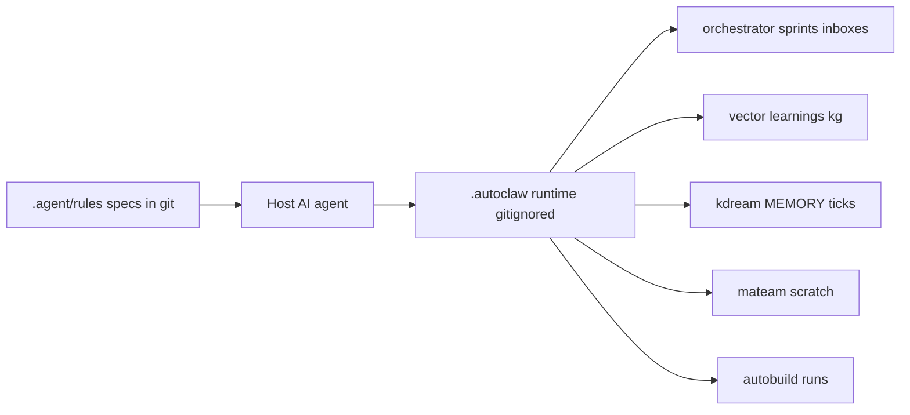

# `.autoclaw` and KDream: Check-in Policy and Purpose

## Short answer

**Do not check in `.autoclaw/` files** (including KDream). They are already gitignored on purpose.

There is no "kstream" subsystem in this project. The closest name is **KDream**, which lives inside `.autoclaw/kdream/`. Same rule applies: local runtime only.

## What is already ignored

[`.gitignore`](../.gitignore) ignores the entire tree:

```
.autoclaw
.autoclaw/
*.autoclaw
```

[AGENTS.md](../AGENTS.md) states this explicitly: all command output under `.autoclaw/` is gitignored; running the system produces no committable diff by design.

**Do not change `.gitignore` to track `.autoclaw/`.** Runtime state must stay local.

## Primary purpose of `.autoclaw/`

`.autoclaw/` is the **file-native operating state** of agent-synthetix. The host AI agent reads [`.agent/rules/*.md`](../.agent/rules/) and materializes coordination and memory as plain files here so that:

- Multiple agents (Cursor, Claude Code, and others) share one board without a server
- Memory and plans survive reboots and tool switches
- Everything is human-auditable (YAML, JSON, Markdown, SQLite)



| Path | Purpose |
|---|---|
| `orchestrator/` | Sprint DAG, assignments, JSON message bus, consensus, heartbeats |
| `vector/`, `learnings/`, `kg/` | Code index + distilled session learnings + coordination facts |
| `kdream/` | Background daemon state, daily logs, append-only `MEMORY.md` |
| `mateam/scratch/` | Per-session role handoffs |
| `autobuild/` | Workflow registry and run logs |

## Primary purpose of KDream specifically

KDream is the **always-on background agent**:

- Watches git drift and TODO/FIXME changes each tick
- Holds long-lived project memory in `.autoclaw/kdream/memory/MEMORY.md` (append-only)
- Periodically consolidates logs into Facts/Observations (`autoDream`)
- Surfaces follow-ups without blocking interactive coding

It is workspace-local institutional memory, not the source of truth for the product design. Product design lives in git (`README.md`, `docs/`, `.agent/rules/`).

## What should be in git

| In git (specs / docs) | Not in git (runtime) |
|---|---|
| [`.agent/rules/`](../.agent/rules/), [`.claude/rules/`](../.claude/rules/) | Entire `.autoclaw/` |
| [README.md](../README.md), [docs/](./), [BRAINSTORM.md](../BRAINSTORM.md), [AGENTS.md](../AGENTS.md) | SQLite DBs, inboxes, heartbeats, run logs, scratchpads, MEMORY.md |

Agents recreate `.autoclaw/` by running commands (`/orchestrate init`, `/kdream start`, `/learn`, and so on).

## Edge cases (still keep ignored)

- Sharing `MEMORY.md` across machines or people is not the current design; memory is local-first.
- Checking in orchestrator manifests or sprint plans would couple the repo to a live run; manifests are authored under `.autoclaw/orchestrator/manifests/` at runtime today.
- If you later want *templates* or *example manifests* in git, put them under `docs/examples/` or `templates/` — not under the live `.autoclaw/` tree.

## Related reading

- [Architecture Principles](./architecture-principles.md) — full subsystem contracts and on-disk layout
- [Architecture Principles §5.4 KDream](./architecture-principles.md#54-kdream--persistent-background-agent)
- [AGENTS.md](../AGENTS.md) — Cursor Cloud runtime notes
