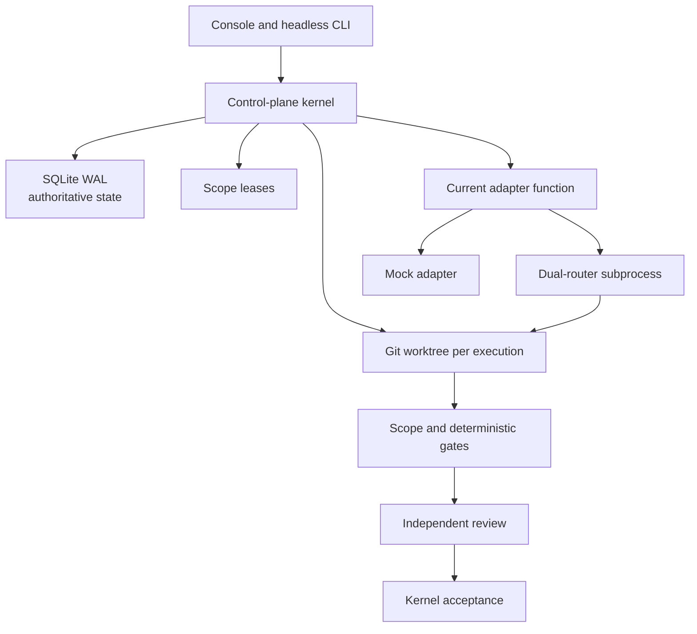
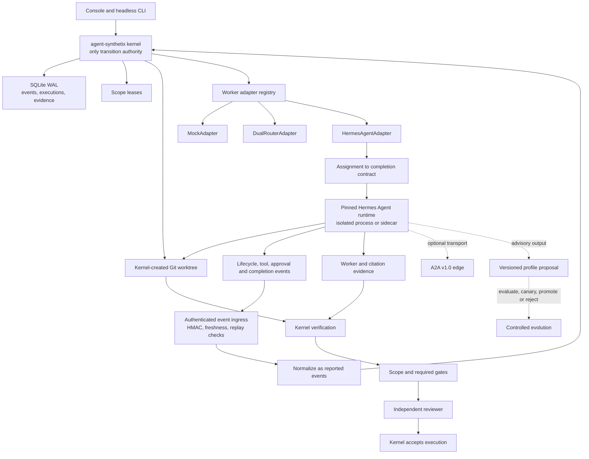

# Hermes Agent integration — to-be architecture proposal

- Status: Proposed
- Date: 2026-08-11
- Scope: Hermes Agent as a governed execution runtime for agent-synthetix
- Upstream baseline: Hermes Agent v0.20.0 (`v2026.8.3`)
- Local baseline at proposal time: Hermes Agent v0.17.0

## Executive decision

Add Hermes Agent as a worker runtime behind the agent-synthetix adapter boundary. Do not replace or duplicate the control-plane kernel.

The kernel remains the only authority for identities, sessions, assignments, leases, worktrees, evidence, reviews, findings, and execution-state transitions. Hermes may reason, use tools, delegate internally, stream events, produce citations, and report completion. Those outputs are untrusted until the kernel validates scope, runs required gates, records provenance, and receives an independent approving verdict.

This distinction also resolves the naming collision:

- **Content Hermes** means the host-agnostic research, blog, thread, and report profiles under `.agent/rules/hermes/`.
- **Hermes Agent** means the Nous Research worker runtime integrated through `HermesAgentAdapter`.

## Goals

- Run Hermes Agent inside the same kernel-created worktrees used by other workers.
- Translate canonical assignments into Hermes completion contracts without weakening scopes or gates.
- Capture lifecycle, tool, approval, citation, and completion evidence through versioned contracts.
- Preserve local-first operation and independent runtime upgrades.
- Leave a compatible path to remote HTTP and A2A transport after local conformance is proven.
- Convert self-improvement output into evaluated, versioned proposals rather than silent mutation.

## Non-goals

- Replacing SQLite WAL with Hermes session state.
- Using Hermes Kanban, worktrees, or approvals as a second orchestration authority.
- Allowing Hermes self-verification to establish acceptance.
- Enabling autonomous coalition formation, automatic merge, deployment, or profile promotion.
- Upgrading the console runtime from Node 22.13+ to match Hermes runtime dependencies.
- Treating upstream feature availability as proof of local integration compatibility.

## Current architecture



The adapter implementation is currently specialized around mock execution and the Python dual-router shim. The execution kernel already owns the durable lifecycle before and after that call, making the adapter seam the correct extension point.

## To-be architecture



## Component responsibilities

| Component | Owns | Must not own |
|---|---|---|
| Control-plane kernel | Assignment, lease, worktree, legal state transition, acceptance | Model reasoning or worker-specific tools |
| Worker adapter registry | Adapter selection, capability checks, common lifecycle interface | Acceptance policy |
| `HermesAgentAdapter` | Transport, contract mapping, external run correlation, cancellation | Scope expansion or gate downgrade |
| Hermes Agent runtime | Reasoning, tools, local delegation, reported results | SQLite writes, branch merge, final acceptance |
| Event ingress | Authentication, replay protection, schema validation, durable receipt | Direct projection mutation from untrusted payloads |
| Evidence verifier | Scope diff, gates, citation verification, provenance | Trusting worker claims without reproduction |
| Independent reviewer | Approving or rejecting current evidence | Reviewing its own execution |
| Profile evolution service | Proposal evaluation, canary, promotion, rollback | Silent self-modification |

## Adapter contract projection

```ts
interface WorkerAdapter {
  capabilities(): Promise<CapabilitySnapshot>;
  start(request: WorkerRunRequest): Promise<WorkerRunHandle>;
  events(runId: string): AsyncIterable<WorkerEvent>;
  approve(runId: string, decision: ApprovalDecision): Promise<void>;
  cancel(runId: string): Promise<void>;
  collect(runId: string): Promise<ReportedWorkerResult>;
}
```

The first implementation should use a local stdio JSON-RPC transport launched with `cwd` set to the assigned worktree. HTTP `/v1/runs` is a later hosted option once workspace mounting, authentication, cancellation, and event resumption have conformance coverage. A2A is an optional discovery and message transport, never a replacement for `TaskAssignment`.

## Assignment mapping

| Canonical assignment field | Hermes completion-contract field | Authority |
|---|---|---|
| `goal` | `outcome` | Kernel assignment |
| `acceptance_criteria` and required gates | `verification` | Kernel assignment and verifier |
| invariants | `constraints` | Kernel assignment |
| read/write scopes | `boundaries` | Kernel leases and diff verifier |
| escalation conditions | `stop_when` | Kernel policy |

Hermes completion judgement is stored as reported evidence. It cannot set `scope_passed`, `gates_passed`, `review_approved`, or `accepted`.

## Event and trust model

All external events enter the system in two stages:

1. Persist the authenticated envelope and delivery outcome idempotently.
2. Normalize supported payloads into `ExecutionEvent` records marked as reported worker telemetry.

Required validation:

- HMAC or transport authentication
- timestamp freshness and nonce replay protection
- known adapter, execution, agent, and session
- strict schema version
- idempotent external event ID
- legal correlation with the current execution attempt

An event such as `run.completed` means the worker stopped successfully. It does not mean the assignment passed scope checks, gates, or independent review.

## Evidence projection

Add evidence types for worker runs and citations:

```ts
type CitationEvidence = {
  claim_id: string;
  url: string;
  title?: string;
  supporting_excerpt?: string;
  retrieved_at: string;
  content_hash: string;
  worker_verification: "supported" | "unsupported" | "unknown";
  deterministic_verification?: "passed" | "failed" | "unavailable";
};
```

ResearchHermes and ReportHermes may consume grounded citation output. The verifier preserves retrieval time and content hash and may independently reproduce critical claims. A changed or unavailable source remains visible; it is not silently treated as verified.

## State projection

Expected schema additions:

| Projection | Purpose |
|---|---|
| `adapter_registrations` | Adapter identity, type, endpoint, enabled status |
| `capability_snapshots` | Versioned, time-bounded worker capabilities |
| `external_runs` | Kernel execution to Hermes run/session correlation |
| `external_event_deliveries` | Raw delivery ID, authentication, replay, normalization status |
| `citation_evidence` | Claim-to-source provenance and verification |
| `worker_approval_requests` | Hermes approval prompts and kernel/operator decisions |
| `profile_proposals` | Later controlled-evolution candidates |
| `profile_evaluations` | Later offline and canary results |

The existing execution state machine remains unchanged. Adapter-specific states map into evidence, findings, and the existing legal transitions.

## Runtime topology

```text
Process A: agent-synthetix console/kernel
- Node 22.13+
- SQLite writer authority
- lease and worktree owner
- localhost API

Process B: Hermes Agent runtime
- pinned and independently upgradeable
- separate managed dependencies
- loopback or stdio transport initially
- assigned worktree only
- no direct control-plane database access
```

Secrets cross the boundary only through an explicit environment allowlist. Persisted diagnostics are redacted. The Hermes runtime version and capability snapshot are attached to every execution for replayability.

## Operational rules

### Mid-run steering

Every redirect becomes an immutable `operator_steer` event. Steering that changes the outcome, scopes, or required gates cancels the attempt and produces a new assignment or attempt. In-scope clarification may continue the same execution.

### Worker approvals

Hermes approval requests are routed through kernel policy. Safe, assignment-scoped commands may follow a predeclared policy. Destructive, network-sensitive, secret-sensitive, or out-of-scope requests require an operator decision or fail closed.

### Delegation and A2A

Hermes subagents and A2A peers inherit the parent execution ID, worktree, scopes, lease expiry, and evidence requirements. They cannot acquire scopes, create assignments, or form coalitions independently.

### Learning and Curator

Hermes `/learn` or Curator output is imported as a proposal with source provenance. Promotion requires evaluation, canary comparison, independent approval, versioning, and rollback. This remains gated until the controlled-evolution roadmap phase.

## Migration and compatibility

- Existing mock and dual-router paths continue unchanged behind the common interface.
- No existing SQLite rows are rewritten destructively.
- New tables and fields use numbered migrations.
- Missing Hermes installation produces an unavailable capability, not a fallback to an ungoverned shell execution.
- The local installed v0.17 runtime remains available until the pinned v0.20 conformance suite passes.
- Legacy file-bus projections remain compatibility views.

## Principal risks

| Risk | Impact | Mitigation |
|---|---|---|
| Two orchestration authorities | Conflicting scopes and state | Kernel remains the only writer; disable Hermes-owned planning/worktrees for managed runs |
| Runtime/version skew | Non-reproducible execution | Pin version, snapshot capabilities, run conformance before enablement |
| Worktree escape | Cross-task modification | Launch in assigned worktree, constrain tools, verify Git/filesystem diff |
| Forged or replayed webhook | False telemetry or transition attempt | HMAC, nonce, timestamp, idempotency, reported-event staging |
| Nested delegation bypass | Hidden coalition or identity loss | Propagate parent execution identity; prohibit new scope acquisition |
| Self-improvement bypass | Silent behavior change | Proposal-only import with evaluation and rollback |
| Duplicate approval systems | Policy drift | Kernel owns approval policy; Hermes requests are inputs |
| Naming confusion | Incorrect product and code assumptions | Reserve `content_hermes` and `hermes_agent` names explicitly |

## Decision records and delivery plan

- [ADR 0002](../adr/0002-hermes-agent-as-governed-worker.md)
- [ADR 0003](../adr/0003-hermes-transport-and-runtime-isolation.md)
- [ADR 0004](../adr/0004-hermes-events-evidence-and-acceptance.md)
- [ADR 0005](../adr/0005-hermes-learning-as-profile-proposals.md)
- [Implementation plan](../../tasks/plan-hermes-agent-integration.md)
- [Task checklist](../../tasks/todo-hermes-agent-integration.md)

## Source baseline

- [Hermes Agent v0.20.0 release](https://github.com/NousResearch/hermes-agent/releases/tag/v2026.8.3)
- [Hermes programmatic integration protocols](https://github.com/NousResearch/hermes-agent/blob/main/website/docs/developer-guide/programmatic-integration.md)
- [Hermes completion contracts](https://github.com/NousResearch/hermes-agent/blob/main/website/docs/user-guide/features/goals.md)
- [Hermes security and approval model](https://github.com/NousResearch/hermes-agent/blob/main/website/docs/user-guide/security.md)

These links establish upstream capabilities. They do not constitute agent-synthetix integration evidence.
