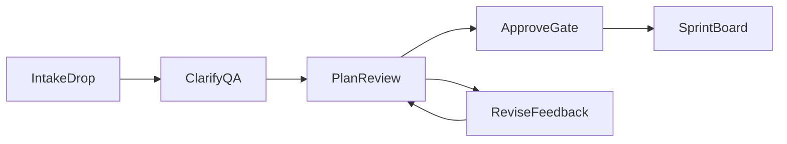

# Orchestrate Control Console — UX Spec

**Status:** Implemented research-preview runtime UI (Intake → Clarify → Plan → Approve → Sprints)
**Surface:** AutoClaw Orchestrate Control Console  
**Audience:** Project owners / tech leads (primary), operators watching sprints (secondary)  
**Maps to:** Soft-gate flow in [README.md](../../README.md) and file contracts under `.autoclaw/orchestrator/`

## 1. Design thesis

End users should complete **“turn ideas into approved, runnable work”** without memorizing slash-commands. The console is a **guided control surface** over the same files agents already use:

- One primary job per screen
- Progressive disclosure of DAG / sprint detail
- An explicit human approval gate before manifest generation
- Soft gate: Sprint Board remains usable with hand-authored manifests



## 2. Jobs to be done

| Actor | Job |
|---|---|
| Project owner | Drop briefs, answer a few questions, review plan, approve |
| Operator | See which sprint/agent is blocked or stalled; revive if needed |

Success metric: a first-time user can go from empty intake to an approved plan (or understand the soft-gate bypass) without reading the full orchestrate rule file.

## 3. Principles

1. **File-native truth** — UI reads/writes the same paths agents use; never invent a shadow database.
2. **One job per screen** — no dashboard hero with stats, schedules, or promo chips.
3. **Brand first** — wordmark “AutoClaw Orchestrate” is a hero-level signal in the shell chrome (not only nav text).
4. **Few questions** — Clarify asks 1–5 critical questions only.
5. **Approval is deliberate** — Approve names the consequence (writes manifest) before the click.
6. **Accessible by default** — WCAG 2.2 AA; drag-and-drop always has a keyboard/file-picker path.

Visual direction and tokens: [design-tokens.md](./design-tokens.md).

## 4. Information architecture

### Shell (persistent)

```
┌──────────────────────────────────────────────────────────────┐
│  AutoClaw Orchestrate                    [Help] [Status ▾]  │
│  Intake → Clarify → Plan → Approve → Sprints                 │
├──────────────────────────────────────────────────────────────┤
│                                                              │
│                   (active step content)                      │
│                                                              │
├──────────────────────────────────────────────────────────────┤
│  Contextual actions (primary + secondary only)               │
└──────────────────────────────────────────────────────────────┘
```

- **Step rail:** Intake → Clarify → Plan → Approve → Sprints (current step emphasized; completed steps checkable)
- **No** card-grid landing, **no** metric strip on Plan Review first viewport
- Content column ~65–75ch on Plan Review; compact lists on Intake / Sprints

### Step ↔ machine status

| UI step | `plans/status.yaml` | Notes |
|---|---|---|
| Intake | `collecting` | Empty intake disables Ask |
| Clarify | `clarifying` | Open vs Answered from `clarifications.md` |
| Plan | `draft` / `awaiting_approval` | After propose |
| Approve | `approved` then `manifested` | Intermediate `approved` required before manifest write completes |
| Sprints | (sprint YAML statuses) | Soft-gate banner if plan status ∉ {`approved`, `manifested`} |

## 5. Screens

### 5.1 Intake

**Job:** Collect source material.

**Layout (wireframe):**

```
┌─────────────────────────────────────────────┐
│  AutoClaw Orchestrate                       │
│  ●Intake  Clarify  Plan  Approve  Sprints   │
├─────────────────────────────────────────────┤
│                                             │
│   ┌─────────────────────────────────────┐   │
│   │  Drop files here or add a note      │   │
│   │  .md .txt .pdf images audio         │   │
│   │  [ Choose files ]                   │   │
│   └─────────────────────────────────────┘   │
│                                             │
│   Catalog                                   │
│   notes.md     text    —                    │
│   brief.pdf    pdf     —                    │
│   _(empty state copy if none)_              │
│                                             │
│              [ Index intake ]               │
└─────────────────────────────────────────────┘
```

**Behaviors:**
- Drop zone + **Choose files** button (not drag-only)
- Catalog mirrors `intake/INDEX.md` (file, type, notes)
- Audio without transcript: inline hint to drop a `.txt`/`.md` transcript
- Empty: show CTA; disable navigation CTA that requires files for Ask

**Empty state copy:** “Drop a brief, notes, or recording transcript to start a project plan.”

### 5.2 Clarify

**Job:** Resolve critical unknowns (max 1–5 questions).

**Layout:**

```
┌─────────────────────────────────────────────┐
│  ○Intake  ●Clarify  Plan  Approve  Sprints  │
├─────────────────────────────────────────────┤
│  Open (2)          Answered (1)             │
│                                             │
│  Q1. What is the primary goal?              │
│  [________________________________]         │
│                                             │
│  Q2. Which paths are in / out of scope?     │
│  [________________________________]         │
│                                             │
│         [ Save answers ]  [ Draft plan ]    │
└─────────────────────────────────────────────┘
```

**Behaviors:**
- Prefer fewer high-impact questions (goals, constraints, scopes, deadlines, out-of-scope)
- Saving answers updates `plans/clarifications.md` (Answered; remove/mark Open)
- **Draft plan** disabled until intake non-empty (and ideally no blocking open questions)

### 5.3 Plan Review

**Job:** Read and critique the proposed plan before approval.

**First viewport (only):** brand (in shell) + plan title + one-line goal + version badge + primary actions (Revise / Continue to approve). Do **not** put risks tables, sprint estimates, or agent stats in the first viewport.

**Below fold:** Phases → tasks (id, name, scope, depends_on, effort) → Constraints / Non-goals → Risks → Open questions.

**Layout:**

```
┌─────────────────────────────────────────────┐
│  ○Intake  ○Clarify  ●Plan  Approve  Sprints │
├─────────────────────────────────────────────┤
│  Project Plan — {title}          v{N}       │
│  {one-line goal}                            │
│                                             │
│  ## Phases … (scroll)                       │
│  ## Risks …                                 │
│                                             │
│     [ Request revise ]  [ Continue → ]      │
└─────────────────────────────────────────────┘
```

**Behaviors:**
- Renders `plans/project-plan.md`
- Revise opens feedback field → `/orchestrate revise` (sidecar `project-plan.v{N}.md`)
- Missing task scopes: warning banner; Approve blocked until fixed

### 5.4 Approve

**Job:** Explicit consent to generate the task manifest.

**Layout:**

```
┌─────────────────────────────────────────────┐
│  ○…  ●Approve  Sprints                      │
├─────────────────────────────────────────────┤
│  Approve this plan?                         │
│                                             │
│  This will:                                 │
│  • Mark the plan approved                   │
│  • Write manifests/<slug>.yaml              │
│  • Unlock sprint planning                   │
│                                             │
│  Summary: {N} tasks · {P} phases            │
│                                             │
│     [ Revise ]        [ Approve plan ]      │
└─────────────────────────────────────────────┘
```

**Behaviors:**
- Primary button labeled **Approve plan** (not generic “Submit”)
- Consequence text referenced via `aria-describedby`
- On success: status `approved` → write manifest → `manifested` → navigate to Sprints with success toast
- Refuse if plan still `collecting` / `clarifying` / `draft` without hand-set `approved: true`

### 5.5 Sprint Board

**Job:** See orchestration progress; act on stalled work.

**Layout:**

```
┌─────────────────────────────────────────────┐
│  ○…  ●Sprints                               │
├─────────────────────────────────────────────┤
│  ⚠ No approved project plan yet — intake    │
│    path recommended. Continuing with        │
│    manifest.                    [ Dismiss ] │
│                                             │
│  Sprint 1  ████░░░░  assigned   WA-1 WA-2   │
│  Sprint 2  ░░░░░░░░  pending    blocked by 1│
│                                             │
│  Stalled: agent-x — Revive                  │
└─────────────────────────────────────────────┘
```

**Behaviors:**
- Linear sprint rows (not a metrics dashboard)
- Drill-in → assignment brief paths (`sprint-N-WA-*.md`)
- Soft-gate banner when `plans/status.yaml` status ∉ {`approved`, `manifested`} — non-blocking
- Stalled agent → **Revive** → `/orchestrate revive <id>`

## 6. Global states

| State | Treatment |
|---|---|
| Loading | Inline skeleton on catalog / plan body; keep step rail interactive |
| Empty intake | CTA + disabled Ask/Draft |
| Approve blocked (no scopes) | Error summary + link back to Revise |
| Soft gate | Info banner on Sprints only |
| Stalled agent | Warning row + Revive |
| Success after approve | Toast + auto-advance to Sprints |

## 7. Accessibility (WCAG 2.2 AA)

- Body text contrast ≥ 4.5:1; accent on interactive elements ≥ 3:1 for UI components
- Visible focus ring (`--focus-ring` in tokens); tab order follows step rail → main → actions
- Drop zone: keyboard-activatable file picker; announce file count via live region after index
- Plan Review: semantic `h1`–`h3` matching markdown headings
- Approve: button `aria-describedby` pointing at consequence list
- `prefers-reduced-motion`: disable step-rail transitions and success toast slide

## 8. Motion (2–3 intentional)

1. Step rail: current step underline eases in (`duration-enter`)
2. Intake: catalog row fade-in when INDEX refreshes (`duration-fast`)
3. Approve success: brief checkmark settle (skip if reduced motion)

No ambient glow, particle, or continuous pulse animations.

## 9. Command / file handoff

| Screen | User action | Slash-command | Reads | Writes |
|---|---|---|---|---|
| Intake | Index files | `/orchestrate intake` | `intake/*` | `intake/INDEX.md`, `plans/status.yaml` |
| Clarify | Ask questions | `/orchestrate ask` | intake + INDEX | `plans/clarifications.md`, status → `clarifying` |
| Clarify | Save answers | _(chat / UI form)_ | — | `clarifications.md` Answered |
| Plan | Draft plan | `/orchestrate propose` | intake + clarifications | `plans/project-plan.md`, status → `awaiting_approval` |
| Plan | Revise | `/orchestrate revise` | `project-plan.md` | sidecar `project-plan.vN.md`, updated plan, status → `awaiting_approval` |
| Approve | Approve | `/orchestrate approve` | `project-plan.md` | frontmatter; status → `approved` then `manifested`; `manifests/<slug>.yaml` |
| Sprints | Refresh | `/orchestrate status` | `sprints/*`, heartbeats | — |
| Sprints | Assign / next | `/orchestrate assign N`, `/orchestrate next` | sprint YAML | assignment briefs, status |
| Sprints | Revive | `/orchestrate revive <id>` | registry, heartbeat | rendered prompt / outbox |

Soft-gate on `/orchestrate plan`: if status ∉ {`approved`, `manifested`}, show one note; **never** hard-block.

## 10. Component inventory (for future implementers)

| Component | Used on | Notes |
|---|---|---|
| `StepRail` | Shell | Not cards; text + underline |
| `DropZone` | Intake | Button + drag |
| `FileCatalog` | Intake | Table/list, not cards |
| `QuestionList` | Clarify | Max 5 |
| `PlanDocument` | Plan | Prose column |
| `ApprovePanel` | Approve | Consequence list required |
| `SprintRow` | Sprints | Progress + agents |
| `SoftGateBanner` | Sprints | Dismissible info |
| `ReviveAction` | Sprints | Secondary button |

Cards are **not** used in heroes or for static content. Interactive panels (Approve) may use a light bordered region only if removing it would hurt understanding of the irreversible action.

## 11. Out of scope

- Remote authentication and hosted multi-user operation
- Hermes publish approval UX
- GitHub Pages marketing/reader site
- Changing DAG / bin-pack algorithms

## 12. Verification checklist

- [x] Five soft-gate steps + Sprint Board specified with wireframes
- [x] Every primary CTA maps to a slash-command or documented file edit
- [x] Soft gate and `approved` → `manifested` transition documented
- [x] A11y requirements include non-drag file intake and Approve consequences
- [x] Tokens avoid purple-gradient / cream-terracotta / broadsheet defaults ([design-tokens.md](./design-tokens.md))

Implementation evidence: [WCAG 2.2 AA accessibility pass](./accessibility-audit-2026-08-11.md).
